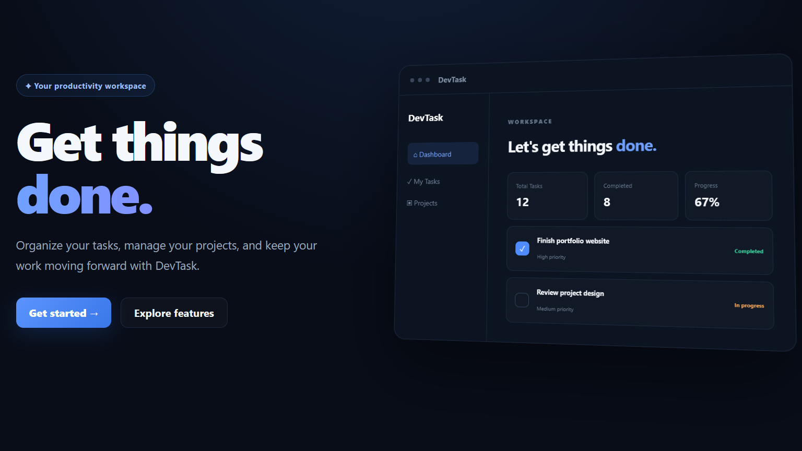
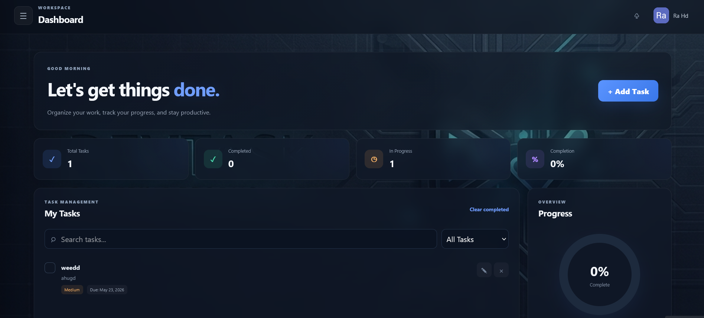
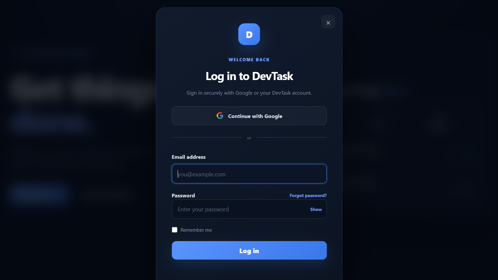

# 🚀 DevTask — Productivity Dashboard

A modern, responsive **task and project management dashboard** built to help users organize tasks, manage projects, and monitor productivity from one centralized interface.

🌐 **[Live Demo](https://dr-strangex.github.io/DevTask/)** · 💻 **[GitHub Repository](https://github.com/dr-StrangeX/DevTask)**

---

## ✨ Features

* 🔐 **Firebase Authentication** — Secure user authentication
* 🔑 **Google Sign-In** — Fast authentication with Google
* 📧 **Email & Password Authentication** — Account registration and login
* 🔄 **Password Reset** — Firebase-powered password recovery
* ✅ **Task Management** — Create, manage, and organize tasks
* 📁 **Project Management** — Track projects and progress
* 📊 **Productivity Dashboard** — View tasks and productivity information at a glance
* 🔍 **Search & Filtering** — Quickly find relevant tasks
* 🌙 **Dark / Light Mode** — Switch between visual themes
* 📱 **Responsive Design** — Optimized for desktop, tablet, and mobile
* 🎨 **Modern UI** — Clean and user-friendly interface

---

## 📸 Preview







---

## 🛠️ Tech Stack

| Technology                     | Purpose                                         |
| ------------------------------ | ----------------------------------------------- |
| 🌐 **HTML5**                   | Application structure                           |
| 🎨 **CSS3**                    | Styling, layouts, themes, and responsive design |
| ⚡ **JavaScript**               | Application logic and interactivity             |
| 🔥 **Firebase Authentication** | User authentication and account management      |
| 🐙 **Git & GitHub**            | Version control and project management          |
| 🚀 **GitHub Pages**            | Application deployment                          |

---

## 🎯 Project Goals

DevTask was created to demonstrate practical web development skills, including:

* 🧩 Building interactive web interfaces
* 📱 Creating responsive layouts
* ⚡ Implementing JavaScript functionality
* 🔥 Integrating Firebase services
* 🔐 Implementing user authentication
* 🎨 Designing modern user interfaces
* 🗂️ Building task and project management functionality
* 🐙 Using Git and GitHub for version control
* 🚀 Deploying a web application with GitHub Pages

---

## 📂 Project Structure

```text
DevTask/
├── assets/
├── images/
├── screenshots/
│   ├── home.png
│   ├── function.png
│   └── login.png
├── action.html
├── dashboard.html
├── index.html
├── script.js
├── style.css
└── README.md
```

---

## 🚀 Getting Started

### 1️⃣ Clone the repository

```bash
git clone https://github.com/dr-StrangeX/DevTask.git
```

### 2️⃣ Open the project

```bash
cd DevTask
```

### 3️⃣ Configure Firebase

The application uses Firebase Authentication.

If running your own instance, configure the Firebase project and update the Firebase configuration in the application files according to your Firebase project.

> ⚠️ Never commit private credentials, service-account keys, passwords, or other sensitive credentials to GitHub.

### 4️⃣ Run the application

You can open `index.html` directly in a browser or use a local development server such as **VS Code Live Server**.

---

## 🔮 Future Improvements

Potential future improvements include:

* [ ] 📅 Calendar integration
* [ ] 🔔 Task notifications
* [ ] 📈 Advanced productivity analytics
* [ ] 👥 Team collaboration
* [ ] 🏷️ Task labels and categories
* [ ] 🖱️ Drag-and-drop task organization
* [ ] 📎 File attachments
* [ ] ☁️ Additional cloud integrations
* [ ] 📱 Enhanced multi-device experience

---

## 👨‍💻 Developer

**Raul Bu Abbass**

💻 Web Developer
🌐 Responsive Websites & Web Applications
⚡ JavaScript • Firebase • HTML • CSS
🐙 [GitHub — dr-StrangeX](https://github.com/dr-StrangeX)

---

## 📄 License

This project is available for **educational and portfolio purposes**.

---

⭐ If you find this project useful, consider giving the repository a star!