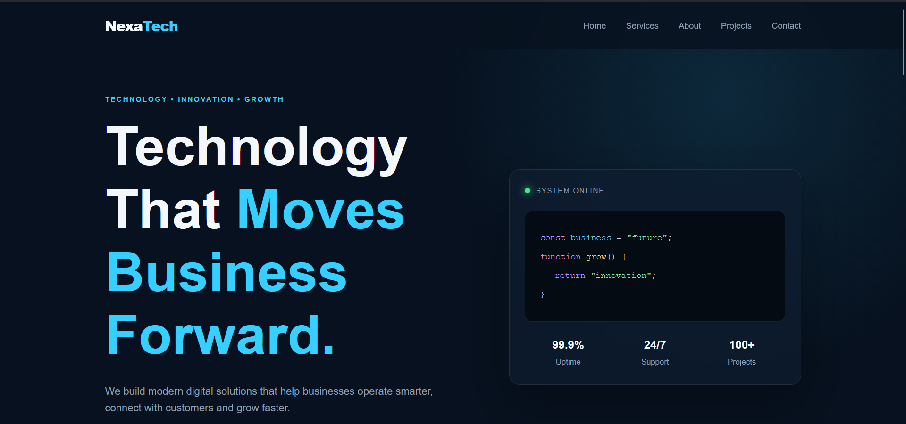

# DevTask

A modern, responsive task management dashboard built with HTML, CSS, and vanilla JavaScript.

DevTask provides a clean productivity interface for creating, organizing, searching, filtering, and completing tasks.



## 🚀 Live Demo

**[Open DevTask](https://dr-strangex.github.io/DevTask/)**

## ✨ Features

- Create tasks
- Edit existing tasks
- Delete tasks
- Mark tasks as completed
- Search tasks
- Filter tasks by status
- Filter tasks by priority
- Automatic task prioritization
- Task completion statistics
- Progress tracking
- Persistent data using browser LocalStorage
- Dark and light theme support
- Responsive mobile layout
- Mobile navigation
- Empty-state handling
- Confirmation dialogs for destructive actions

## 🛠️ Technologies

- HTML5
- CSS3
- JavaScript (ES6+)
- LocalStorage API
- Git
- GitHub
- GitHub Pages

## 📁 Project Structure

```text
DevTask/
├── index.html
├── style.css
├── script.js
├── images/
│   └── website-preview.png
├── README.md
└── .gitignore
